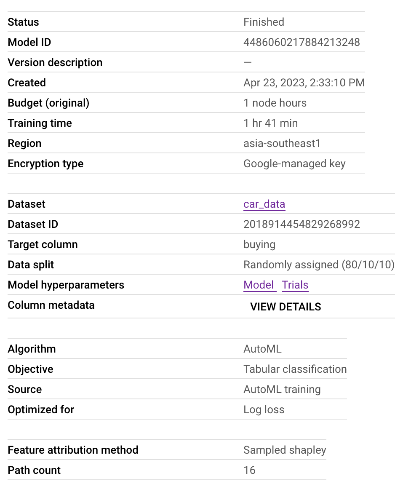
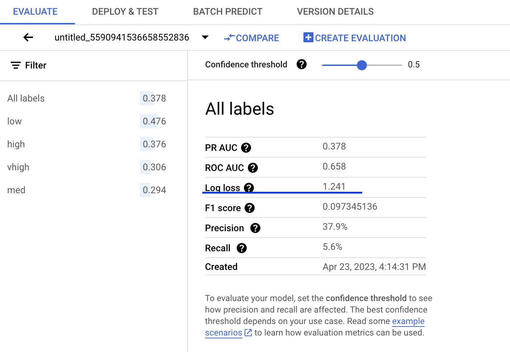
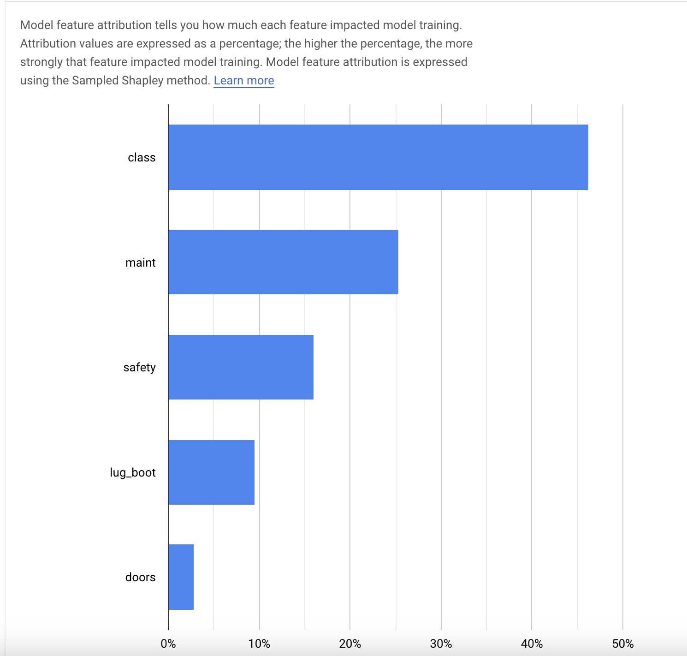
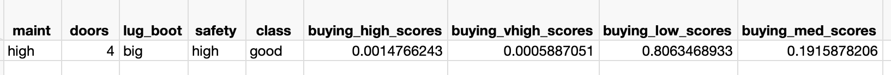

### Predict Car Buying Price 
This document describes multiclass classification for categorical data by using GCP AutoML for tabular data service.

### Settings

Download the dataset, add column names, convert it to csv file and upload the csv file to Google Cloud Storage.

* Data spilt: 80% for training, 10% for validation, and 10% for testing.
* Features: maint, doors, lug_boot, safety, class.
* Metric: log loss, which measrues how close the prediction probability is to the corresponding actual value.

### Model Result

The model shows log loss is 1.24.

Feature importance: it seems that the class feature plays an important role in the model.

### Result

For the following feature, the buying price has high probability to be **LOW** as the highest probability is the predicted result for the given data point.

