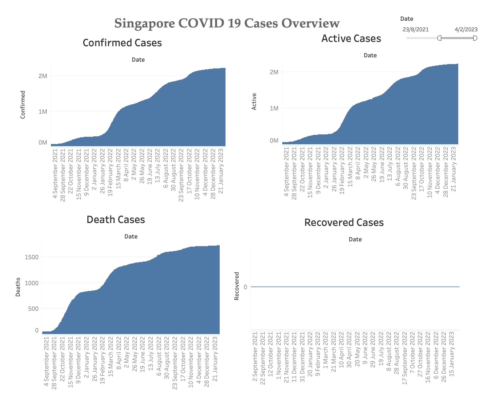

## Singapore COVID 19 Cases Dashboard

The current idea:

1. use Python to dowload data using the API https://covid19api.com/

''

2. load data into Tableau 2023.1

Other ideas:

Load data into database, use Dash, R Shiny or Tableau connect to the database and build the dashboard

### Dashboard

