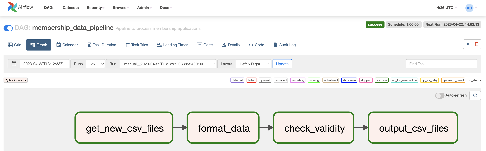

## Pipeline for Membership Applications Processing

This document describes the design and implementation of a pipeline to process membership applications for an e-commerce company. 
The pipeline will ingest, clean, perform validity checks, and create membership IDs for successful applications.

### Prerequisites
- Python 3.10
- Apache Airflow 2.5.3
- SQLAlchemy 1.4.41

### Assumptions
- No middle name present in the name column.
- No area code in the mobile_no column.
- No letter in the data_of_birth column.
- The pipeline finishes within 30 minutes when it starts.
For example, if the pipeline starts at 8:00 am, it should finish no later than 8:30 am.

### Pipeline Components

The pipeline consists of four components.

1. Data Ingestion

  **Task id: get_new_csv_files**
  
  Check if any new file in the targeted folder with a buffer time of 10 minutes, if there are new files, combine them into one dataframe.

2. Data Cleaning and Transformation

  **Task id: format_data**
  
* Remove rows with missing values on name and date_of_birth column.
* Remove duplicate rows.
* Separate name column into first name and last name using regular expression, which ignores suffix and prefix.
* Format date_of_birth column as YYYYMMDD.
* Remove spaces in mobile_no column.
* Add above_18 column as of 1 Jan 2022.

3. Perform Validity Checks

  **Task id: check_validity**
  
Successful applications critira: 

* mobile_no column has a length of 8;
* age above 18;
* email ends with .com or .net.

Create membership id for successful applications.

4. Write Results to Folders

  **Task id: output_csv_files**
  
  For sucessful applications, the data is store at the successful folder, otherwise, in unsuccessful_folder.
  
  File name also has a datetime tag YYYYYMMDDHH for easy tracking.

### Pipeline Test Run Result

No failure.

### Suggestions to Upstream

Establish a data poilcy, which will make the whole application process more efficient and effective.

* No suffix or prefix allowed, just have first name and last name input boxes;
* Only allow one format for birthdate;
* Check the length of the phone number; otherwise, don't allow submission.
