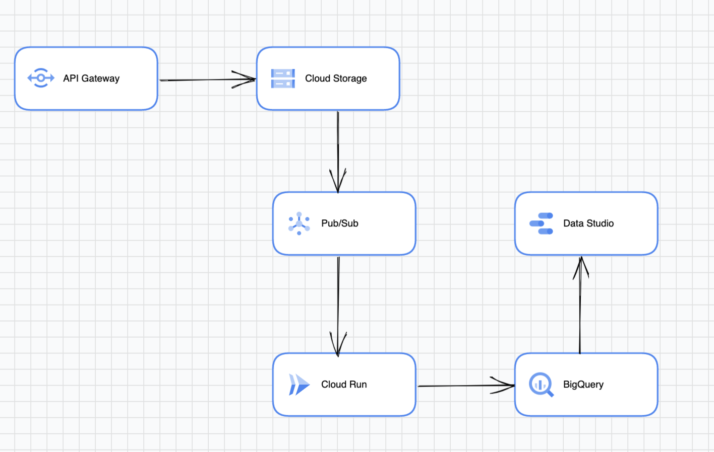

### System Design for an Image Processing Service
This document describes google cloud architecture design for an image processing service.
It focuses on the main components and the overall flow. 
The system design covers front end, storage, and processing, as well as the data consumption.

### Assumptions

* The image processing code can be containerized, making it easy to deploy and manage.
* The processed data is structured.
* The team is comfortable with Confluent on GCP.

### Components

**API Gateway**

The API Gateway acts as the single entry point for all client requests, thus don't need two web applications. It provides authentication, rate limiting, and logging functionalities to ensure secure and controlled access to the service.

**Google Cloud Storage (GCS)**

GCS is used to store the uploaded images and processed images in different buckets. A lifecycle policy is set up on the two buckets to automatically delete objects older than 7 days, addressing the compliance and privacy requirements. 

**Pub/Sub**

Google Cloud Pub/Sub is used as a messaging service to decouple image processing from the image storage. It triggers the Cloud Run service once new images are uploaded to GCS.

**Cloud Run**

This serverless platform runs the containerized image processing code. It auto-scales based on the number of incoming messages from Pub/Sub and processes the images accordingly.

**BigQuery**

Processed data are stored in BigQuery, a fully managed data warehouse. This facilitates easy analysis and reporting by the Business Intelligence (BI) team. A scheduled query is used to delete data older than 7 days.

**Google Data Studio**

The BI team can use Google Data Studio to create interactive dashboards and reports by connecting to BigQuery datasets. This allows stakeholders to visualize and analyze the processed data effectively. 

### Flow

1. The user uploads images via the API Gateway, which authenticates and validates the request.
2. The uploaded images are stored in the targeted GCS bucket.
3. A Pub/Sub message is triggered when new images are uploaded to GCS, notifying the Cloud Run service.
4. The Cloud Run service processes the images using the containerized image processing code and saves the processed images back to GCS. It also stores relevant metadata and insights in BigQuery.
5. The BI team designs dashboards and reports in Google Data Studio by connecting to the BigQuery datasets.

By taking advantage of Google Cloud Platform services, this system design ensures an efficient and effective image processing service.

