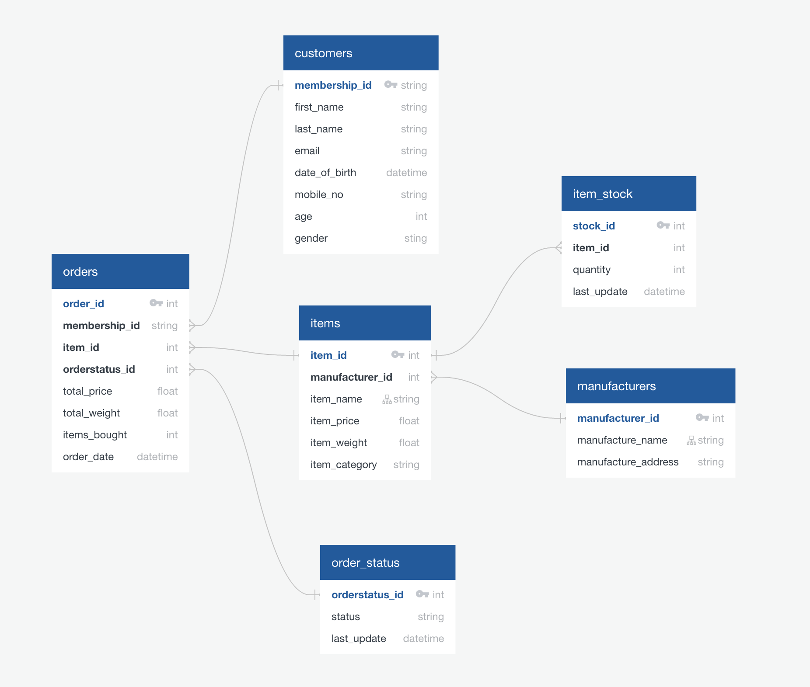
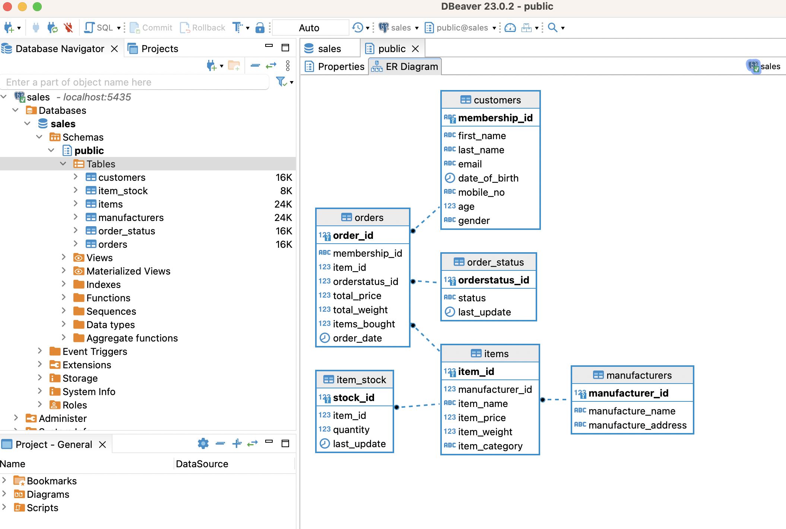
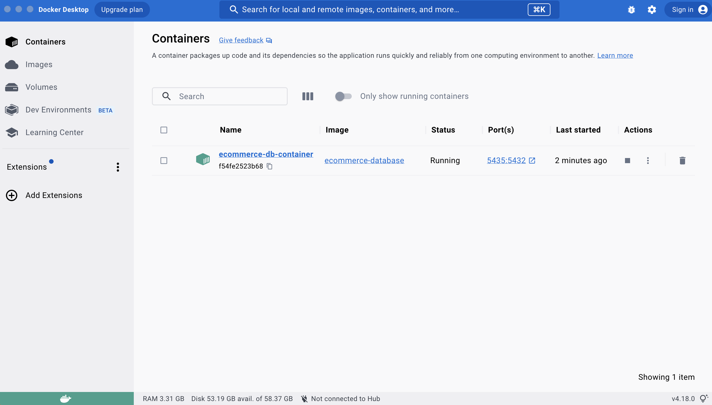

## PostgreSQL Database Design for E-commerce Sales Transactions

This document describes the design and implementation of a PostgreSQL database for an e-commerce company. 
The database is hosted in the Docker.

### Prerequisites
- Docker version 20.10.24, build 297e128
- PostgreSQL 15.2

### Database Overview

The database consists of the following six tables:

* orders
* customers
* items
* order_status
* item_stock
* manufacturers

By designing those tables, different teams can get different insights from the database.

logistic team:

* total item weight
* how long is the shipping process
* update order shipping status

business insight team:

* popular items (index on item_name)
* popular manufacturers (index on manufacture_name)
* frequent shoppers

warehouse team

* inventory status

### Advantage of Indexes

- Improve query performance: indexing can help avoid full table scan and reduce the numbers of records need to be scaned, thus speed up the query process time;

- Improve filtering and sorting performance: when a column is used in the WHERE and ORDER BY clauses, index the column can help filter and sort data quickly;

- Improve join performance: when joining large tables, index can help find matching records quickly.

### Entity Relationship Diagram

### Dbeaver Database View

### Docker View

